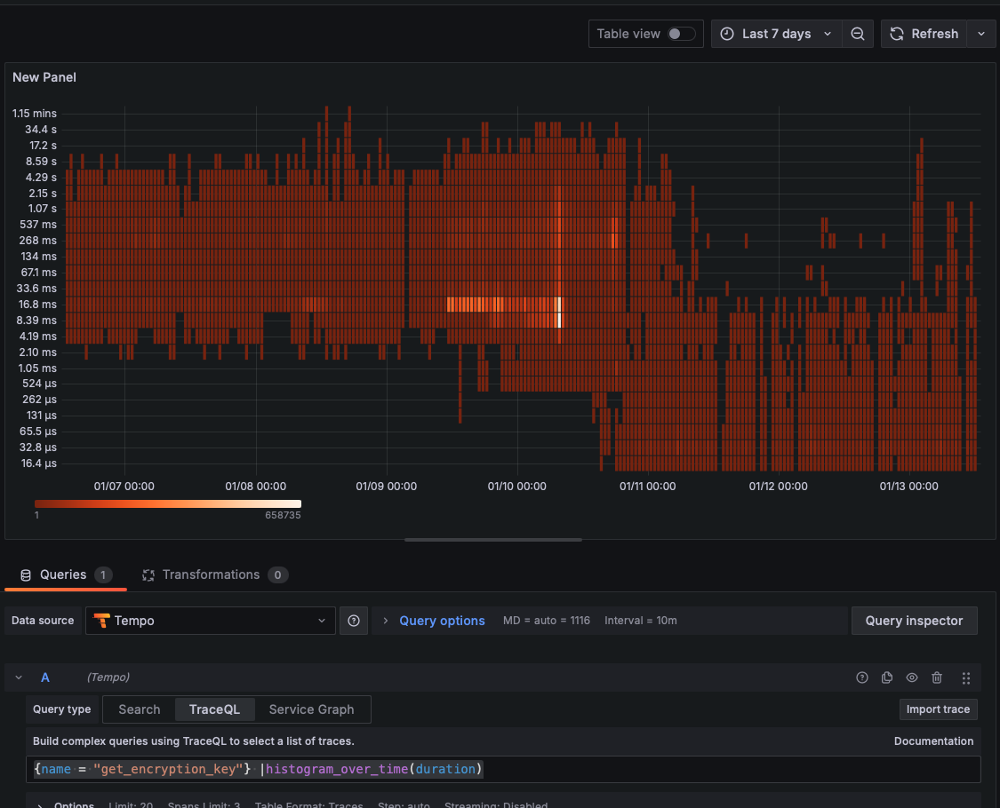

+++
date = '2025-02-25T22:05:54Z'
draft = false
title = 'How we speed up 80% of Samaya AI and saved millions of $$$'
description = "What a journey it has been! In this post, I’ll walk you through how we transformed Samaya AI by boosting its performance by 80% and saving millions of dollars along the way."
tags = ["AI infra"]
categories = ["blog"]
ShowToc = true
TocOpen = true
[cover]
image = "final-architecture.png"
alt = "Final Architecture Overview"
caption = "Our Optimized Architecture"
relative = true
+++

We began by taking a hard look at our existing system. My predecessor set up some Amplitude metrics. Our simple QA takes about 2 minutes to finish.
Though Amplitude is good for product/user analytics, it's now powerful enough for profiling. After building some latency breakdown and p99 graphs, I start to worry that the push model of Amplitude python client would introduce more latency, and I need to do more in time series graphs like calculations, so I bring in Prometheus and Grafana to our infra, under a monitoring namespace in k8s for both prod and staging clusters.

Our baseline metrics showed significant room for improvement:

## Identifying Bottlenecks

Our analysis revealed several critical bottlenecks:

## Performance Optimization Journey

### Phase 1: TensorRT
I used Nvidia's TensorRT to convert our model in vLLM to be more performant.

Key metrics we tracked:
- Problematic concurrent network calls: 
- CPU Utilization: 
- Network Latency: 

### Phase 2: Caching and Distribution
I found that the redis cache calls were taking 500ms.
Suspect the latency come from poor network call concurrency from Python.

Improvements in cache performance:

### Monitoring and Observability

I implemented opentelemetry traces and metrics. I use Tempo, Prometheus, and Grafana to visualize:

Distributed tracing helped identify bottlenecks:

Error rates dropped significantly:

## Results and Impact

### Performance Improvements

### Cost Savings

System throughput increased dramatically:

## Comparison with Industry Standards

## Future Roadmap

## Monitoring Setup
Our current monitoring configuration:

