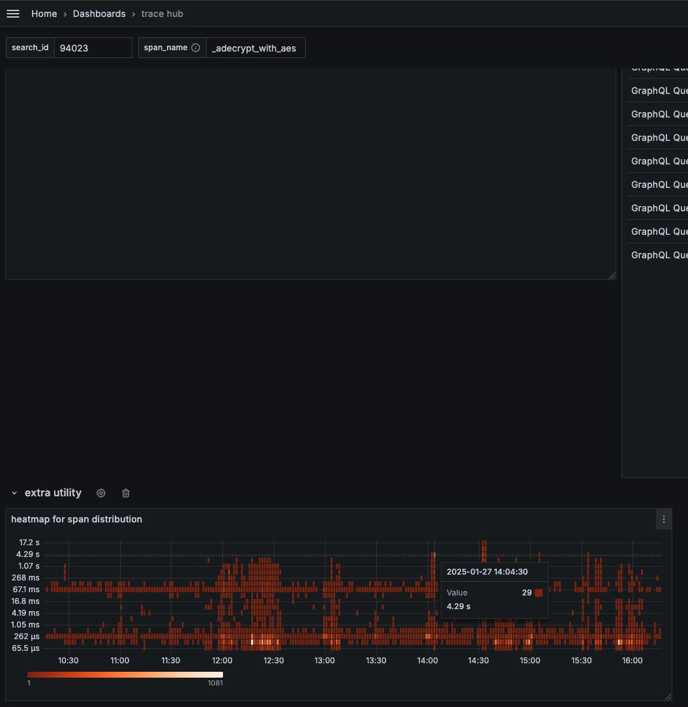
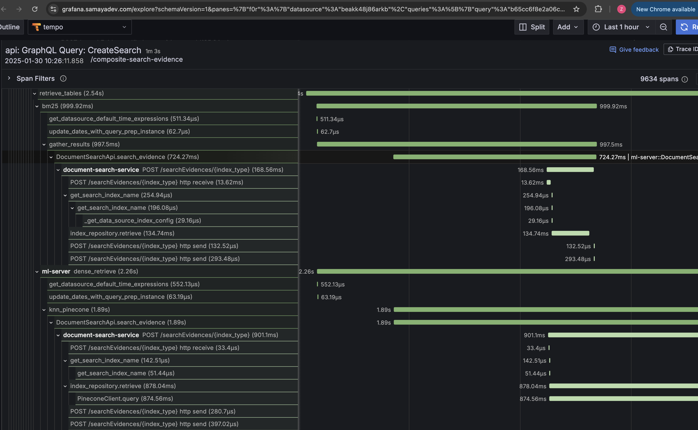
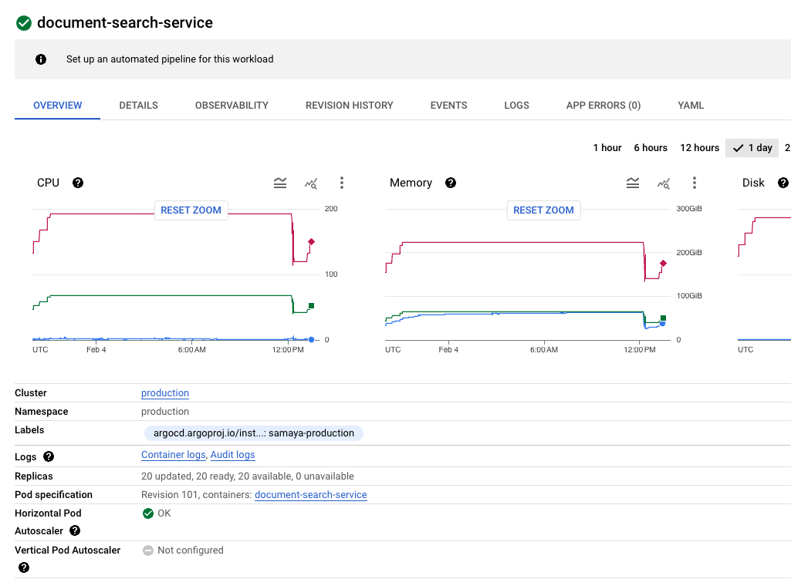
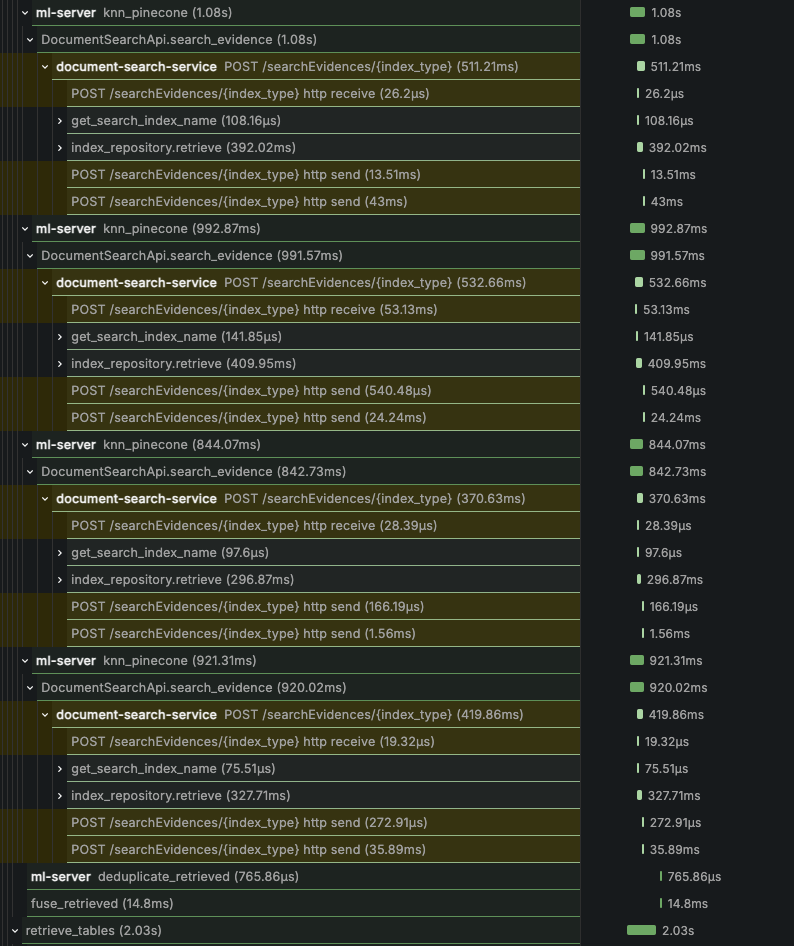
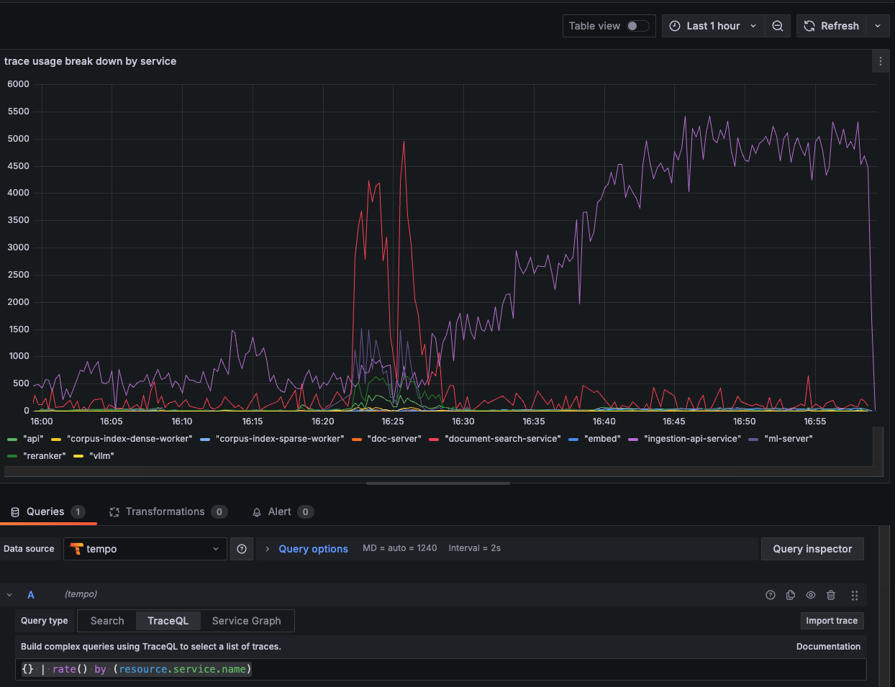

+++
date = '2025-02-25T22:05:54Z'
draft = false
title = 'How we speed up 80% of Samaya AI and saved millions of $$$'
description = "What a journey it has been! In this post, I’ll walk you through how we transformed Samaya AI by boosting its performance by 80% and saving millions of dollars along the way."
tags = ["AI infra"]
categories = ["blog"]
ShowToc = true
TocOpen = true
[cover]
image = "slowest-query.png"
alt = "Slowest query of the day"
caption = "Our production query, sort by slowness"
relative = true
+++

We began by taking a hard look at our existing system. My predecessor set up some Amplitude metrics. Our simple question answering bot takes about 2 minutes to finish.
Though Amplitude is good for product/user analytics, it's not powerful enough for profiling. After building some latency breakdown and p99 graphs, I start to worry that the push model of Amplitude python client would introduce more latency, and I wanted more functionalities in these time series graphs like doing arithmetic calculations between two signals. So I bring in self hosted Prometheus and Grafana to our infra, under a monitoring namespace in k8s for both prod and staging clusters.

## Identifying Bottlenecks

Our analysis revealed several critical bottlenecks:

## Performance Optimization Journey

### Phase 1: TensorRT
I used Nvidia's TensorRT to convert our model in vLLM to be more performant.

- Problematic concurrent network calls: 
- Unreliable endpoints: 
- Side by side comparison: 

### Phase 2: Caching 
I found that the redis cache calls were taking 500ms.
Suspect the latency come from poor network call concurrency from Python.

database calls:

This heatmap shows two hot zones for the simple getting encryption key operation, one near 16.8ms, the other near 537ms:

### Monitoring and Observability

I implemented opentelemetry traces and metrics. I use Tempo, Prometheus, and Grafana to visualize.

We use Tilt to spin up k8s locally. Application log vs execution trace side by side:

Distributed tracing helped identify bottlenecks:

Error rates dropped significantly:

I needed sampling and retention to reduce the Terrabytes of data used in traces.

## Results and Impact

### Performance Improvements

### Cost Savings

System throughput increased dramatically:

## Comparison with Industry Standards

## Future Roadmap

## Monitoring Setup
Our current monitoring configuration:

