+++
date = '2025-02-25T22:05:54Z'
draft = false
title = 'How we speed up 80% of Samaya AI and saved millions of $$$'
description = "What a journey it has been! "
tags = ["AI infra"]
categories = ["blog"]
ShowToc = true
TocOpen = true
[cover]
image = "slowest-query.png"
alt = "Slowest query of the day"
caption = "Our production query, sorted by slowness"
relative = true
+++

In this post, I’ll walk you through how we transformed Samaya AI by boosting its performance by 80% and saving millions of dollars along the way.

Samaya AI builds a question answering platform using document retrieval to avoid hallucination. At the start of this work, our basic question answering chatbot takes about 2 minutes to finish processing.
Besides latency, scale is also a concern. Samaya is at a crucial junction of product market fit and user growth. We try to find low effort big gains, and then complex re-architectures to setup the system for the next couple of years.

We began by taking a hard look at our existing system. My predecessor set up some Amplitude metrics. 
Though Amplitude is good for product/user analytics, it's not powerful enough for profiling. After building some latency breakdown and p99 graphs, I start to worry that the push model of Amplitude python client would introduce more latency, and I wanted more functionalities in these time series graphs like doing arithmetic calculations between two signals, or adding attribute to data points for filtering. So I bring in self hosted Prometheus and Grafana to our infra, under a monitoring namespace in k8s for both prod and staging clusters.
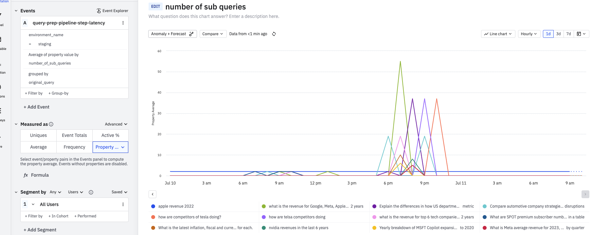

### Monitoring and Observability

Metrics gave a view of a broad sense of how system is doing, but I needed something finer to see the devil in the details. I implemented opentelemetry traces. I use Prometheus, Tempo, and Grafana to visualize. I like open source tools and am able to ask questions to the community and contribute.

We use Tilt to spin up k8s locally. Application log vs execution trace side by side:
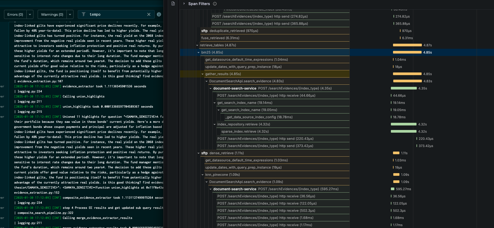

- Errors and timeouts: 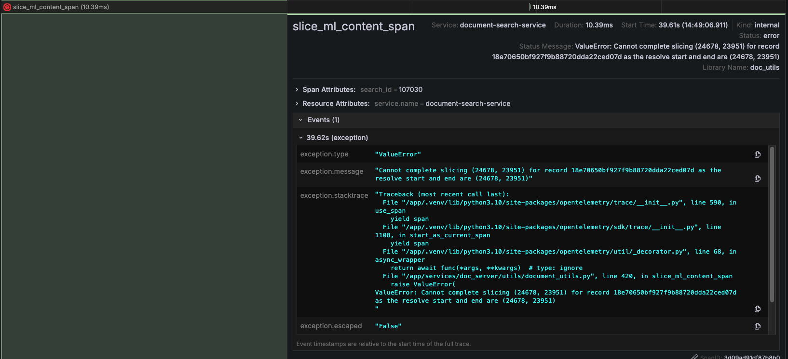
- Unreliable endpoints: 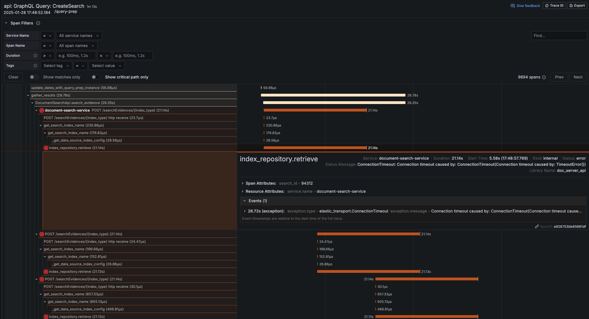
- Side by side comparison on a fast run vs a slow run: 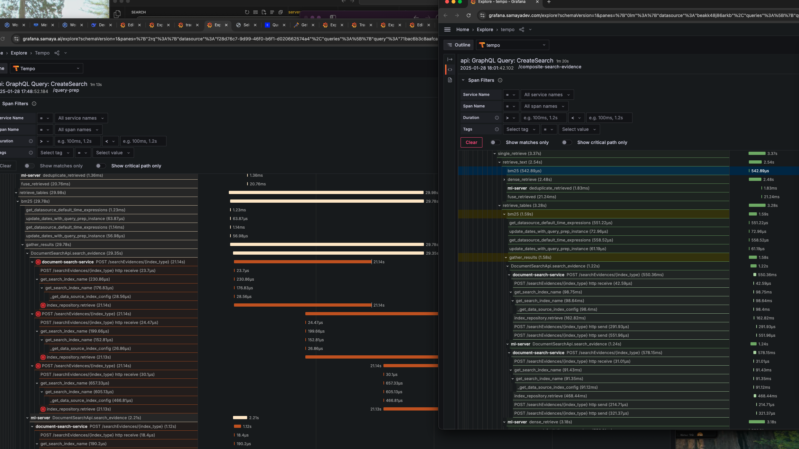

breakdown and Locust load test
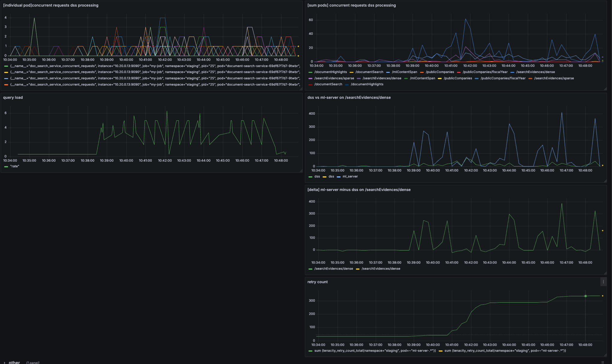

Distributed tracing helped identify bottlenecks:
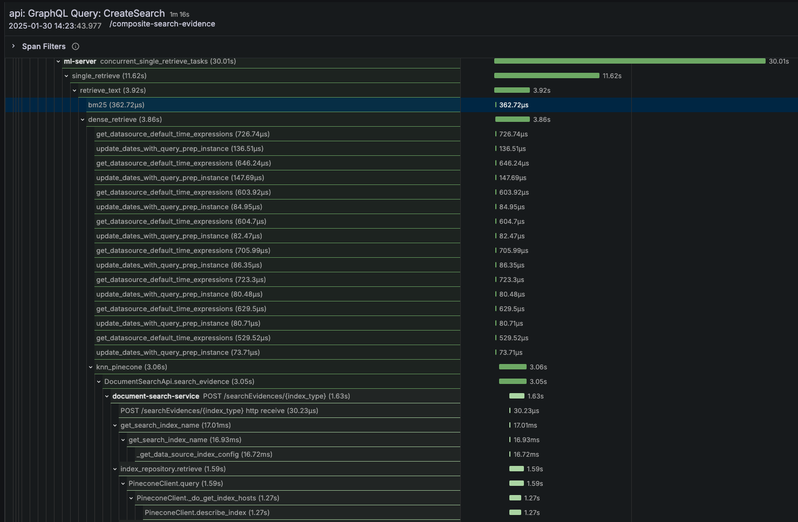

Error rates dropped significantly:
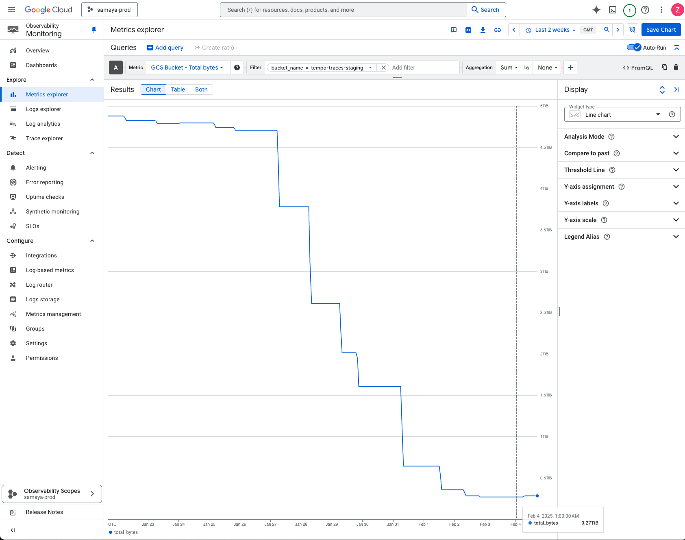
I needed sampling and retention to reduce the Terrabytes of data used in traces.

## Identifying Bottlenecks

Our analysis revealed several major latency contributors:
Query understanding, document retrieval, and summarization.

## Performance Optimization Journey

### TensorRT
I use Nvidia's TensorRT to convert our model in vLLM to be more performant.

### Caching 
I found that the redis cache calls were taking 500ms.
Suspect the latency come from poor network call concurrency from Python.
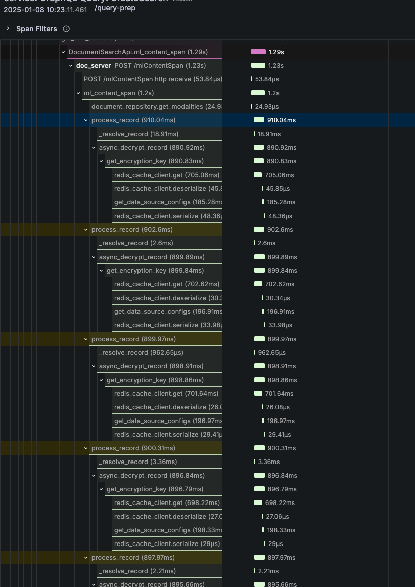

This heatmap shows two hot zones for the simple getting encryption key operation, one near 16.8ms, the other near 537ms:

Similarly, key validation function could take way longer than it should.
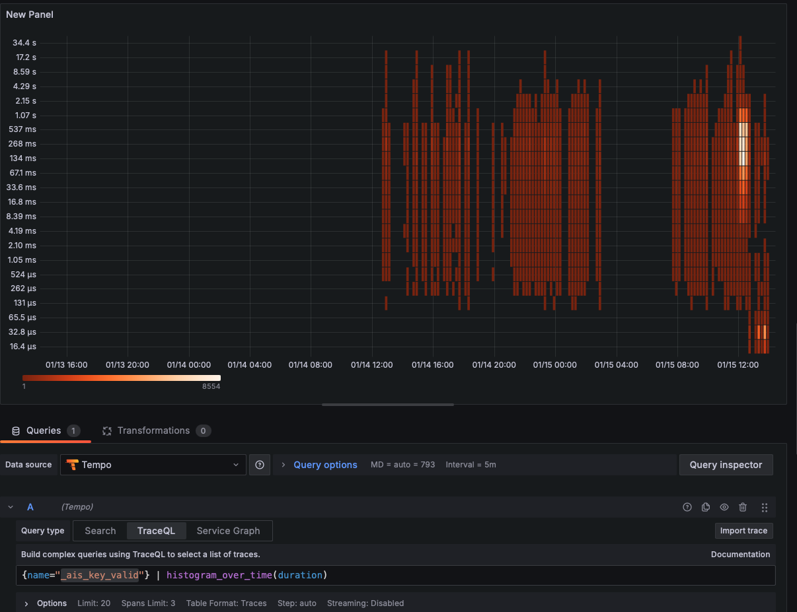

### Parallelization 
We found many places where we are doing sequential operation where it could be running in parallel, like bm25 elastic search sparse retrieval vs pinecone vector dense retrieval, or text generation vs table generation. These parallelization cut some of the major latency factors in half. 
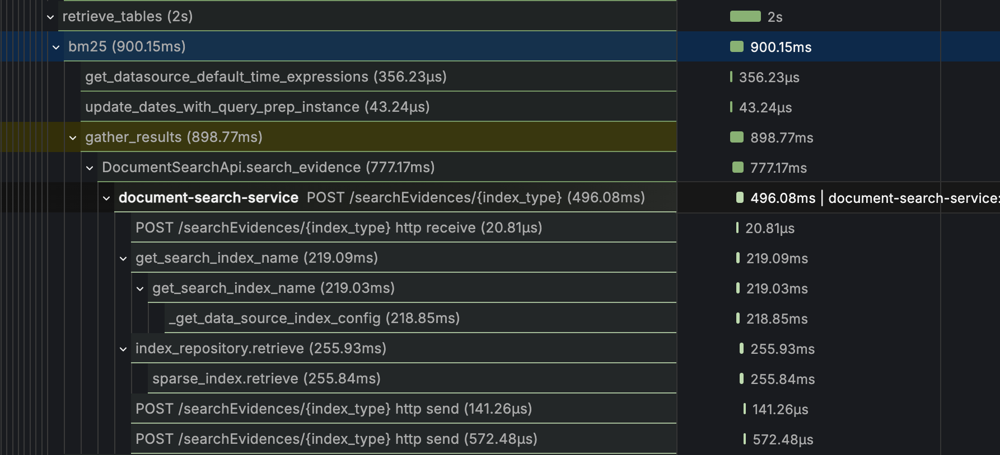

### DB
latency is high to pinecone and mongodb when we send large batch of queries.
database calls:
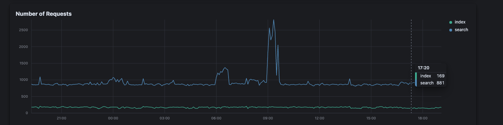
We found by experiments that a connection pool of 20 works better compared to 1000, 100, and 10.

### Python to Golang
while python is a great prototyping language that is native to ML ecosystem, switching to Go can bring benefits post-protoyping stage.
We carefully seperated Python ML logic from the rest of the software like api, business logic, db calls, and migrate them one by one to Go.

## Results and Impact

### Cost Savings
saving 100k in infra a month
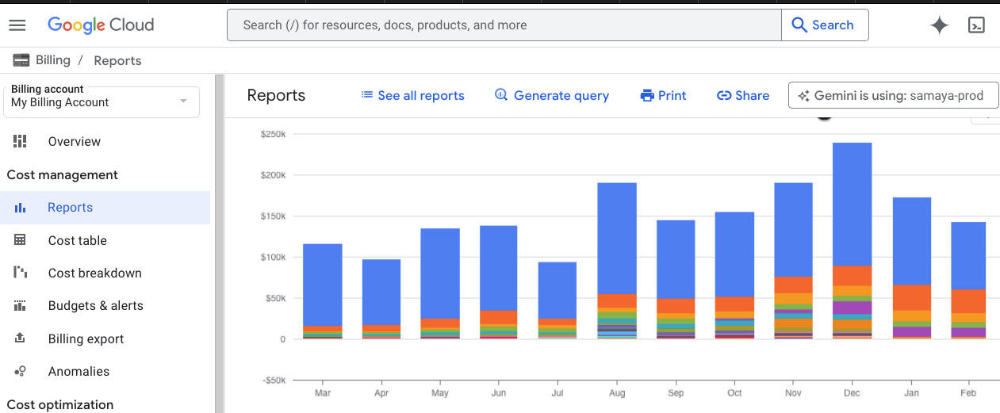

## P90 e2e decrease
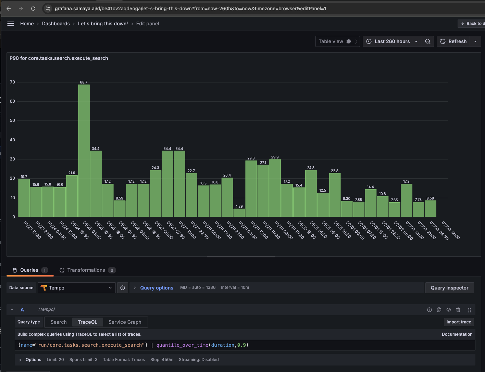

