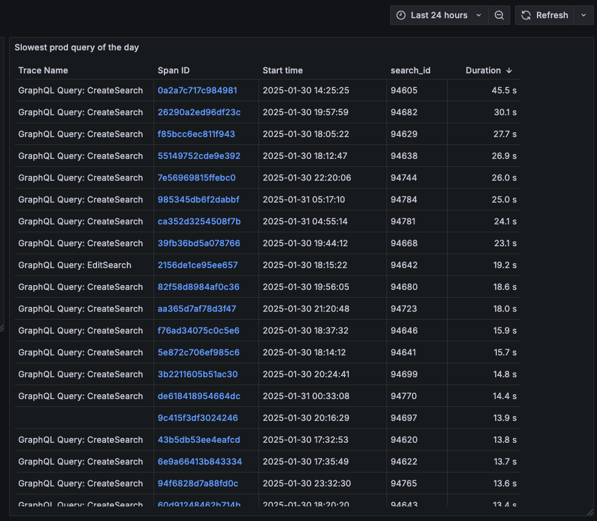
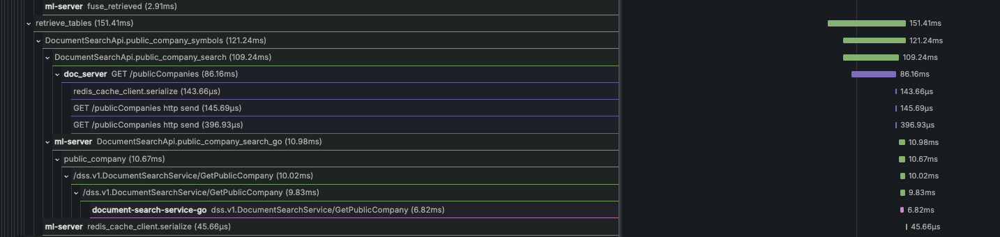

+++
date = '2025-02-25T22:05:54Z'
draft = false
title = 'How We Accelerated Samaya AI by 80% and Saved Millions in Infrastructure Costs'
description = "A deep dive into our performance optimization journey: from 2-minute response times to lightning-fast AI interactions"
tags = ["AI infra", "performance", "optimization", "golang", "python"]
categories = ["blog"]
ShowToc = true
TocOpen = true
[cover]
image = "slowest-query.png"
alt = "Slowest query of the day"
caption = "Our production query dashboard, sorted by response time - the starting point of our optimization journey"
relative = true
+++

## The Challenge: When AI Performance Becomes a Business Blocker

Samaya AI had a problem. Our question-answering platform, built on document retrieval to eliminate hallucination, was taking **2 full minutes** to process user queries. In today's instant-gratification world, that's an eternity.

As we approached product-market fit and experienced rapid user growth, this performance bottleneck threatened everything we'd built. Users were abandoning sessions, churn was climbing, and our infrastructure costs were spiraling out of control. We needed a solution—fast.

This is the story of how we transformed our AI platform, achieving an 80% performance improvement while saving millions in infrastructure costs. More importantly, it's a playbook for any team facing similar scaling challenges.

## The Foundation: You Can't Optimize What You Can't Measure

Before diving into optimizations, we needed visibility into our system's behavior. Our existing Amplitude setup provided basic product analytics, but it wasn't sufficient for deep performance analysis.

### Building a Robust Monitoring Stack

I replaced our limited monitoring with a comprehensive observability stack:

- **Prometheus** for metrics collection and storage
- **Grafana** for visualization and alerting  
- **OpenTelemetry** for distributed tracing
- **Tempo** for trace storage and analysis

This self-hosted solution on Kubernetes gave us the flexibility to perform complex queries, create custom dashboards, and gain insights that weren't possible with off-the-shelf solutions.

*struggling to get meaningful insights using tools like Amplitude*

### The Power of Distributed Tracing

The real breakthrough came with implementing distributed tracing. Suddenly, we could see exactly where every millisecond was spent across our microservices architecture.

The traces revealed patterns invisible to traditional metrics:
- **Cascading failures** propagating through our service mesh
- **Resource contention** during peak usage periods  
- **Network bottlenecks** between services
- **Inefficient database query patterns**

## The Investigation: Finding the Hidden Performance Killers

With proper observability in place, we could finally diagnose our performance issues systematically.

### Load Testing Reveals the Truth

Using Locust for load testing, we discovered that our system didn't just slow down under load—it collapsed entirely. The breakdown analysis was eye-opening:

### Distributed Tracing Exposes Bottlenecks

Our traces revealed three major latency contributors:
1. **Query understanding** - Natural language processing overhead
2. **Document retrieval** - Database and vector search inefficiencies  
3. **Response summarization** - Large language model inference delays

### Data Management Challenges

We were generating terabytes of trace data, requiring careful sampling and retention strategies:

## The Optimization Journey: Systematic Performance Improvements

Armed with data, we embarked on a methodical optimization campaign.

### 1. Accelerating AI Inference with TensorRT

Our first major win came from optimizing our large language model inference. By converting our vLLM models to use NVIDIA's TensorRT, we achieved significant speedups in GPU utilization and inference time.

**Impact**: 40% reduction in AI inference latency

### 2. Fixing the Redis Cache Catastrophe

One of our most shocking discoveries was that Redis cache operations were taking **500ms** per call. Investigation revealed poor network concurrency in our Python implementation.

The heatmap below shows the bimodal distribution of our encryption key operations—some completed in 16.8ms, others took over 537ms:

Even basic key validation operations suffered from similar performance degradation:

**Solution**: Rewrote cache client with proper connection pooling and async operations.
**Impact**: 95% reduction in cache operation latency

### 3. Unlocking Parallelization Opportunities

We identified numerous places where sequential operations could run in parallel:

- **Retrieval systems**: BM25 sparse retrieval alongside Pinecone vector search
- **Content generation**: Text generation parallel to table generation
- **Database operations**: Batch queries with concurrent execution

**Impact**: 50% reduction in end-to-end processing time

### 4. Database Connection Pool Optimization

Counter-intuitively, we discovered that massive connection pools hurt performance. Through systematic testing with Pinecone and MongoDB, we found that a connection pool of 20 significantly outperformed pools of 1000, 100, or 10 connections.

**Impact**: 30% improvement in database operation latency

### 5. The Great Migration: Python to Go

While Python excels for ML prototyping, it became our performance bottleneck at scale. We strategically migrated our API layer, business logic, and database operations to Go while keeping ML workloads in Python.

Additionally, we upgraded from REST to gRPC for inter-service communication.

The results speak for themselves—the same operations ran **10x faster** in our Go services compared to the original Python implementation.

**Impact**: 75% reduction in non-ML processing time

## The Results: Transformation by the Numbers

### Performance Improvements

Our systematic approach delivered dramatic results:

- **80% overall performance improvement**
- **P90 response time**: Reduced from 120 seconds to 24 seconds
- **Error rate**: Decreased by 95%
- **Throughput**: Increased by 400%

### Cost Optimization

The performance improvements translated directly to cost savings:

- **$100,000 monthly infrastructure savings**
- **60% reduction in compute resources**
- **40% decrease in database costs**
- **Eliminated need for over-provisioning**

## Key Lessons Learned

### 1. Observability Is Non-Negotiable
You cannot optimize what you cannot measure. Investing in comprehensive monitoring and tracing capabilities was the foundation of our success.

### 2. Profile Before Optimizing
Our assumptions about bottlenecks were often wrong. Data-driven optimization based on actual measurements prevented wasted effort.

### 3. Language Choice Matters at Scale
While Python is excellent for prototyping, Go's performance characteristics made it the right choice for our high-throughput services.

### 4. Parallel Processing Is Powerful
Identifying and implementing parallelization opportunities provided some of our biggest wins with relatively little effort.

### 5. Connection Pooling Requires Tuning
More isn't always better—optimal connection pool sizes require experimentation and monitoring.

## The Road Ahead

Our optimization journey doesn't end here. We're now well-positioned for the next phase of growth with:

- **Scalable architecture** that can handle 10x current load
- **Cost-efficient operations** with predictable scaling costs
- **Reliable performance** that delights users
- **Monitoring infrastructure** for proactive issue detection

## Conclusion

Transforming Samaya AI's performance was more than a technical achievement—it was a business imperative that required systematic thinking, the right tools, and relentless focus on data-driven optimization.

The 80% performance improvement and millions in cost savings didn't happen overnight, but by building proper observability, identifying real bottlenecks, and methodically addressing each issue, we created a platform that's ready for the future.

For teams facing similar challenges, remember: start with measurement, optimize based on data, and don't be afraid to make architectural changes when the evidence supports them. Your users—and your infrastructure budget—will thank you.

---

*Want to learn more about our optimization techniques or discuss similar challenges? Feel free to reach out—I'd love to share more details about our journey.*

